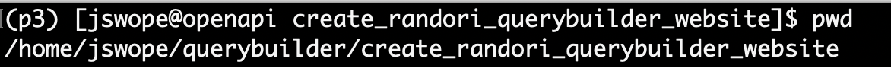
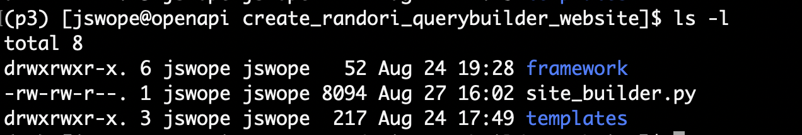
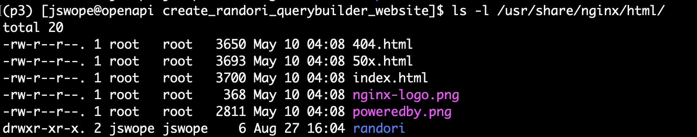
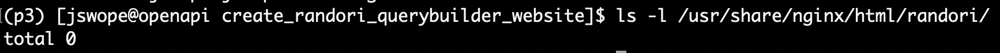
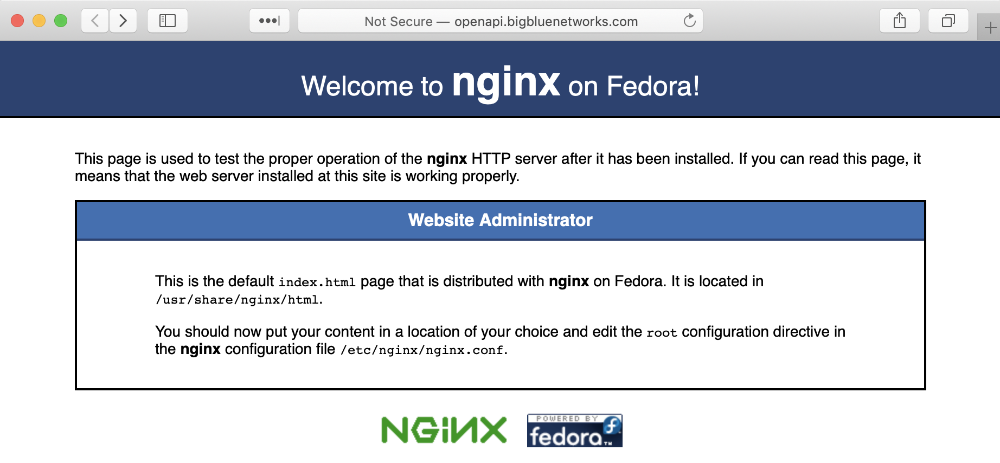
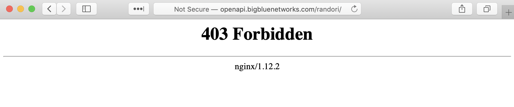
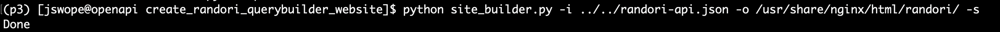
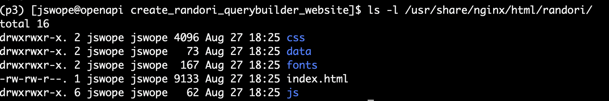
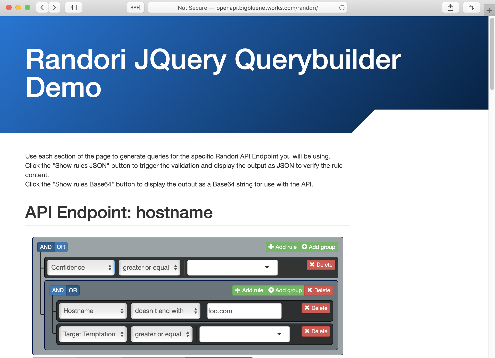

# Automatic Randori Querybuilder Website Generator

This repo is intended to be an easy to use tool to generate a self-contained web page that can be used to generate queries for use with the Randori API.

The web page, CSS files and JavaScript files are all either contained in the repo or generated when the python script is run.

The one file that is needed, but not provided in the repo is the API specification file [randori-api.json](https://alpha.randori.io/openapi) (must be authenticated to access).

The python script reads the Randori API Spec file and creates a web page with a query generator for each endpoint defined in the spec.

The script requires the use of Python 3.

## Usage
```
usage: site_builder.py [-h] -i INPUT -o OUTPUT [-s]

required arguments:
  -i INPUT, --input INPUT
                        File containing the Randori API Spec.
  -o OUTPUT, --output OUTPUT
                        Directory in which to write the generated files.

optional arguments:
  -h, --help            show this help message and exit
  -s, --setup           If the setup arg/flag is provided, copy the contents
                        of the 'framework' directory to the output directory.
```


## Example 

This example was performed on a CentOS 7 VM using Python 3 in a Virtual Environment.

The working directory and its contents



The contents of the default nginx web root directory.
Note the one addition to the directory, the randori directory with ownership set to my user account.


The contents of the randori directory located in the root to the nginx web root.


Screenshot of the default web page.


Screenshot of the error when trying to browse to the /randori path before running the script.


Screenshot of running the script with the 'setup' flag and the output, aka "Done".
``` python site_builder.py -i ../../randori-api.json -o /usr/share/nginx/html/randori/ -s ```


Screenshot of the randori directory in the nginx web root directory after having run the script.


Screenshot of the now rendering web page located at the /randori path after having run the script.



